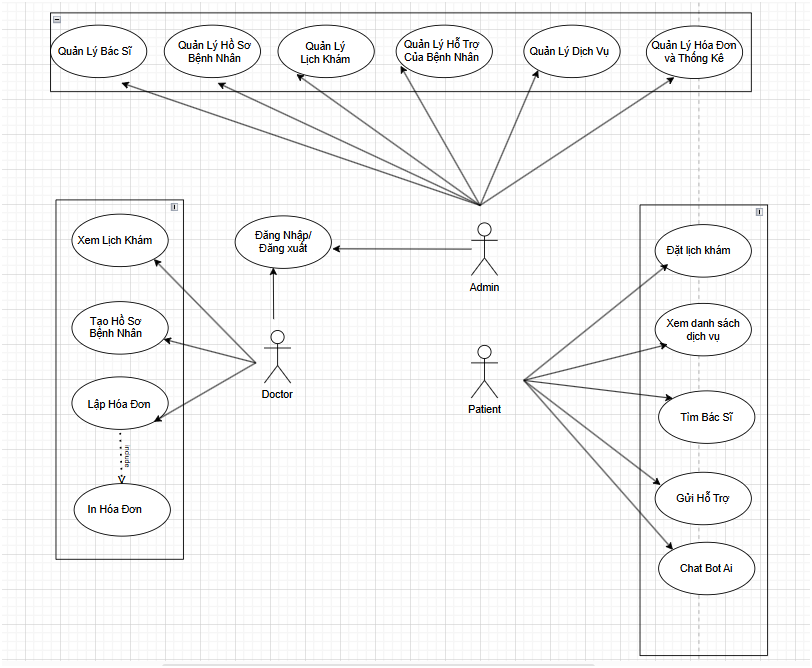
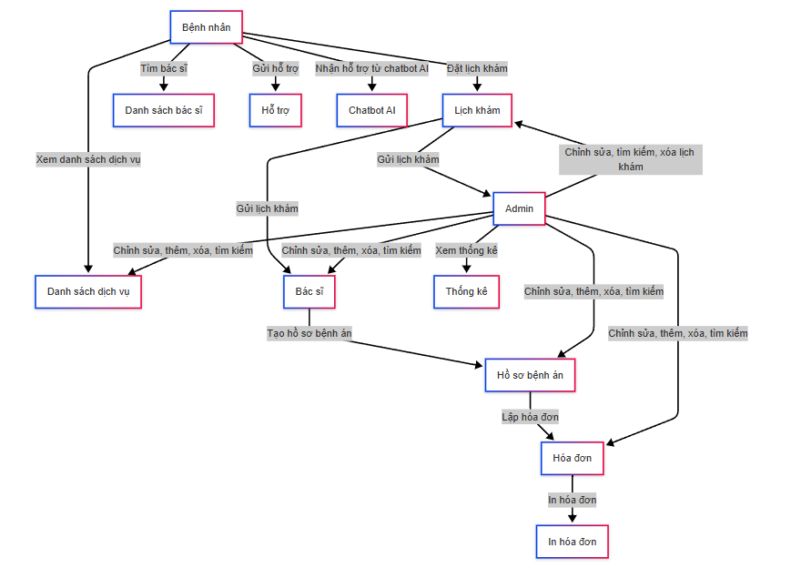
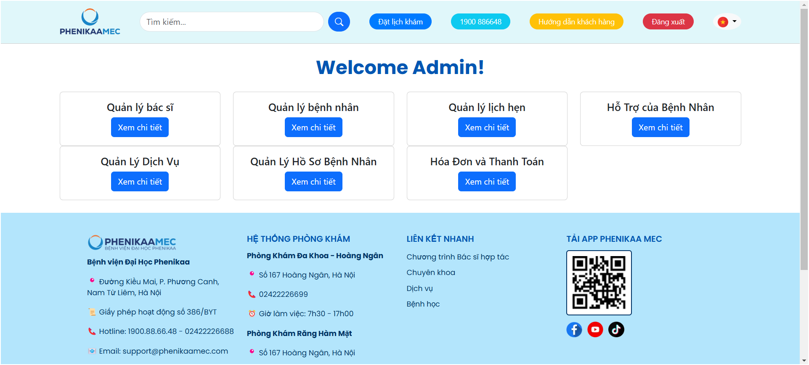
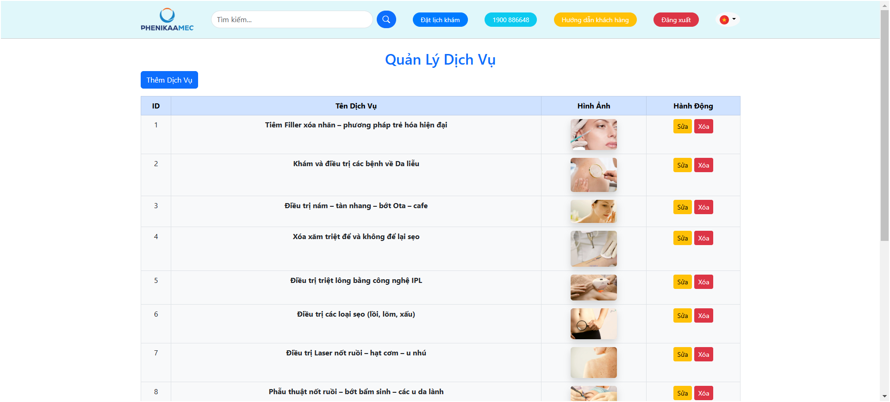
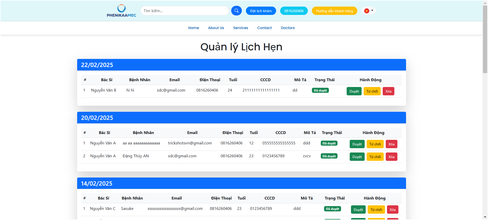
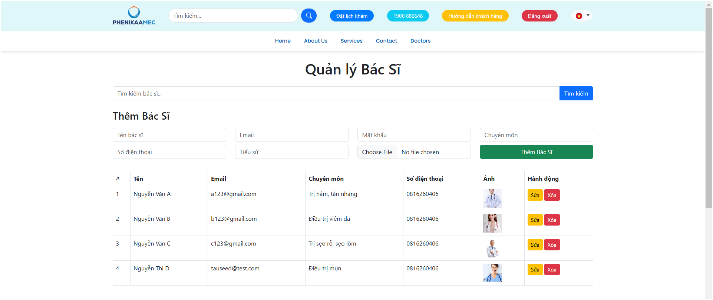
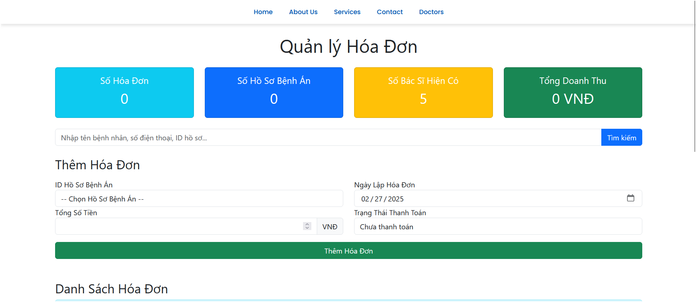
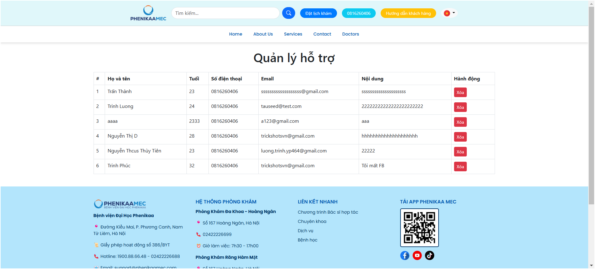

# 🏥 Quản Lý Phòng Khám Da Liễu


## 🚀 Giới thiệu

**Quản Lý Phòng Khám Da Liễu** là hệ thống giúp quản lý các hoạt động của phòng khám, bao gồm bác sĩ, bệnh nhân, lịch hẹn, dịch vụ y tế, hồ sơ bệnh nhân, thanh toán và hỗ trợ. Dự án sử dụng **Laravel** và **Bootstrap**, đảm bảo giao diện thân thiện và trải nghiệm mượt mà.

---

## ✨ Tính năng chính

💪 **Quản lý bác sĩ**: Theo dõi danh sách bác sĩ, chuyên môn và hồ sơ cá nhân.  
👨‍⚕️ **Quản lý bệnh nhân**: Theo dõi danh sách bệnh nhân đăng ký khám bệnh.  
💊 **Quản lý dịch vụ**: Thêm, sửa, xóa các dịch vụ khám da liễu.  
📅 **Quản lý lịch hẹn**: Cho phép bệnh nhân đặt lịch, sau khi đặt thì lịch sẽ hiện ở 2 phía Bác Sĩ và Admin. Admin có quền xem và chỉnh sửa.  
📝 **Quản lý hồ sơ bệnh nhân**: Lưu trữ và quản lý thông tin y tế của từng bệnh nhân.  
💳 **Quản lý hóa đơn & thanh toán**: Tạo và theo dõi hóa đơn, xử lý thanh toán.  
📢 **Hỗ trợ bệnh nhân tích hợp ChatBot AI**: Nhân Viên phản hồi và hỗ trợ bệnh nhân nhanh chóng. Cùng với đó hệ thống Chatbot AI có thể phản hồi ngay lập tức .  
📊 **Thống kê & Báo cáo**: Hiển thị tổng quan về hoạt động phòng khám, doanh thu.  
🔒 **Phân quyền tài khoản**: Hệ thống đăng nhập với vai trò **Admin, Bác sĩ**.

---

## 🛠 Công nghệ sử dụng

| Công nghệ  | Phiên bản |
| ---------- | --------- |
| Laravel    | >7.x      |
| Bootstrap  | 5.x       |
| MySQL      | 8.x       |
| JavaScript | ES6+      |
| jQuery     | 3.x       |

---

### 🔹 Sơ đồ Use-Case



### 🔹 Sơ đồ chức năng



## 🛠 Cài đặt & Khởi chạy

### 📌 1. Clone repository

```sh
git clone https://github.com/luongtrinh2004/Quan_Ly_Phong_Kham_Da_Lieu
cd ...
```

### 📌 2. Cấu hình môi trường

```sh
cp .env.example .env
php artisan key:generate
```

🎡 Cập nhật file `.env` với thông tin database của bạn.

### 📌 3. Cài đặt các dependencies

```sh
composer install

```

### 📌 4. Tạo database từ file laravel_backup.sql

```sh

mysql -u root -p ten_database < laravel_backup.sql

```

### 📌 4. Cập nhật file .env với thông tin database của bạn:

```sh

DB_CONNECTION=mysql
DB_HOST=127.0.0.1
DB_PORT=3306
DB_DATABASE=ten_database
DB_USERNAME=root
DB_PASSWORD=your_password


```

### 📌 5. Chạy ứng dụng

```sh
php artisan serve
```

---

## 📸 Hình ảnh giao diện

### 🔹 Trang quản lý Admin



### 🔹 Quản lý dịch vụ



### 🔹 Đặt lịch khám



### 🔹 Quản lý bác sĩ



### 🔹 Hóa đơn & Thanh toán



### 🔹 Hỗ trợ bệnh nhân



---

### 🔹 Deploy Dự Án

```sh
https://31c4-118-70-185-2.ngrok-free.app

```

### 🔹 Link repo

```sh
https://github.com/luongtrinh2004/Quan_Ly_Phong_Kham_Da_Lieu

```

### 🔹 Link demo

```sh
.................

```
